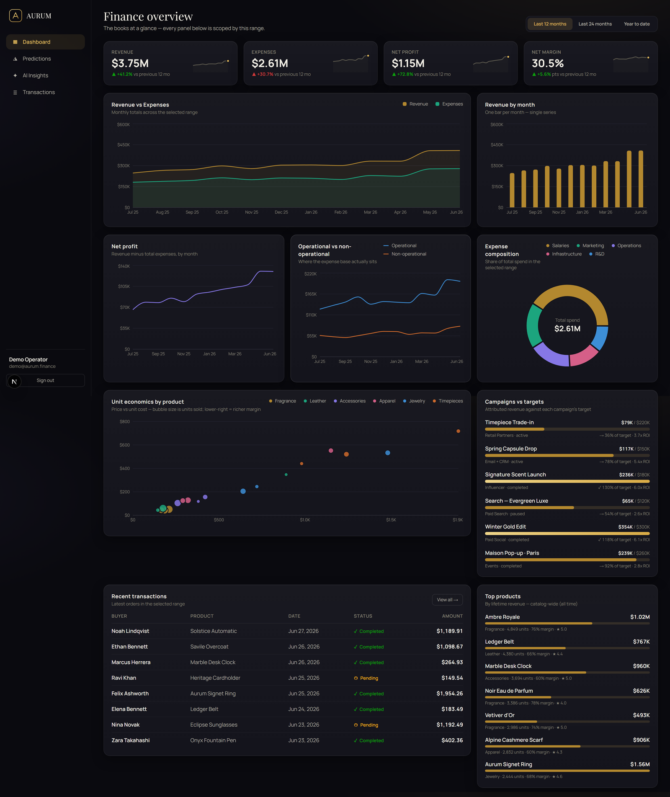
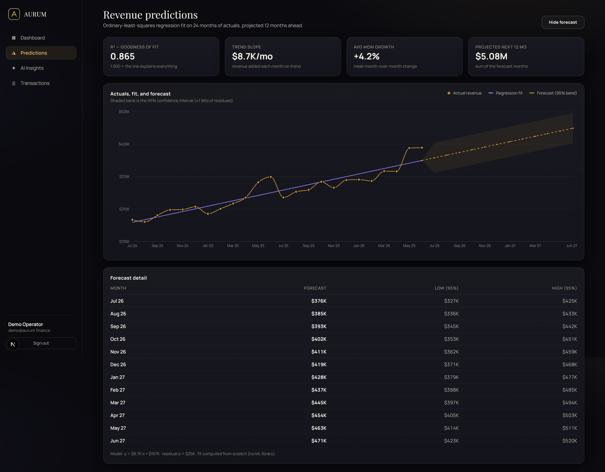
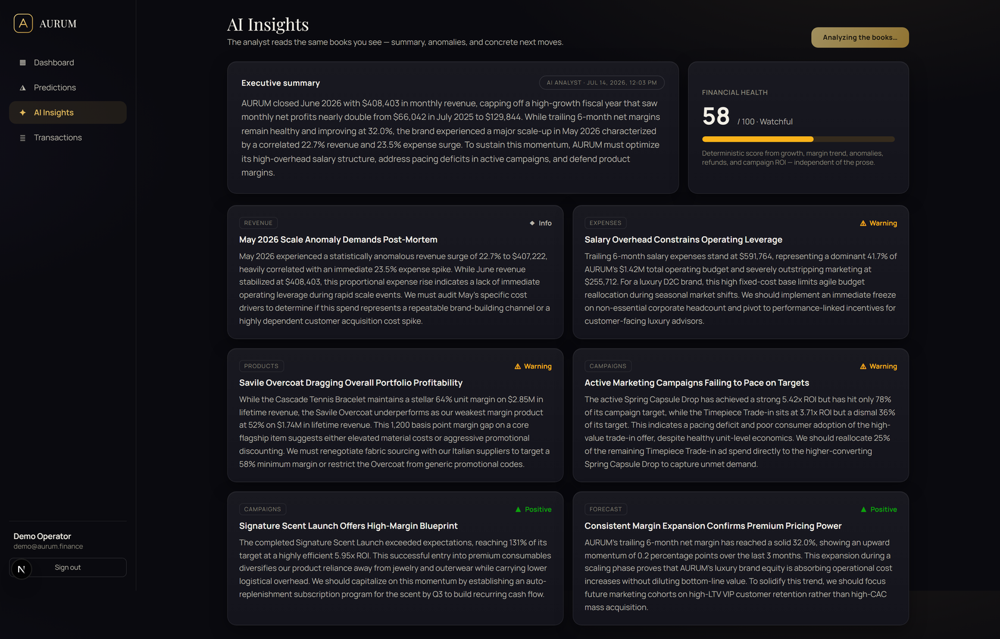
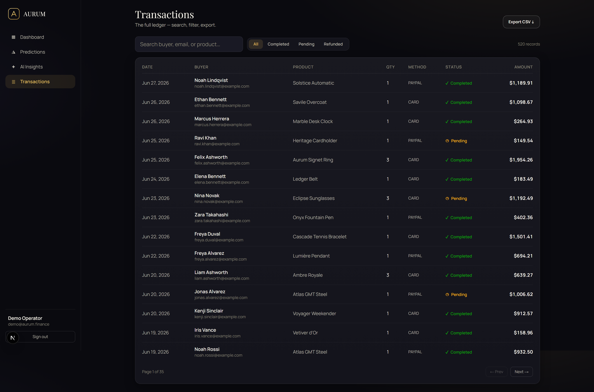
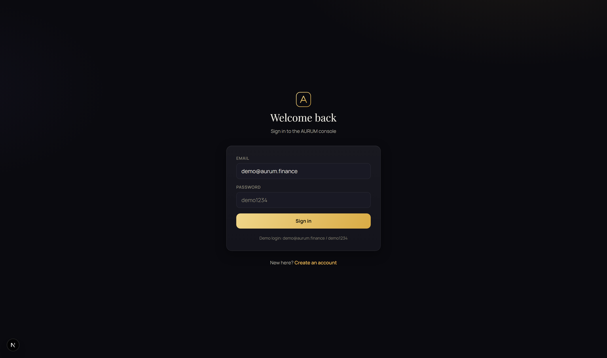

<div align="center">

# 🅰️ AURUM

### AI Finance Intelligence Dashboard

*A luxury-grade, full-stack financial analytics console — two years of books, a from-scratch revenue forecast, and a Claude-powered CFO analyst, all in one dark-glass workspace.*

<br/>

### 🔗 See This Project Live

**▶ [https://aurum-finance-dashboard.vercel.app](https://aurum-finance-dashboard.vercel.app)**

<br/>

[](https://aurum-finance-dashboard.vercel.app)

<br/>

[](https://nextjs.org/)
[](https://react.dev/)
[](https://www.typescriptlang.org/)
[](https://tailwindcss.com/)
[](https://www.postgresql.org/)
[](https://www.prisma.io/)
[](https://www.anthropic.com/)

[](LICENSE)


</div>

---

## 📖 Overview

**AURUM** is a full-stack financial analytics platform for a premium direct-to-consumer luxury brand. It puts an entire finance office — **two years of P&L, expense composition, product unit economics, a 520-row transaction ledger, and marketing-campaign performance** — into a single, cohesive dark-glass dashboard, and layers two "intelligence" features on top:

- 📈 **A revenue forecast** built from an ordinary-least-squares linear regression **written from scratch** — no ML library, so every line is explainable.
- 🤖 **An AI analyst** (Anthropic's **Claude**) that reads the *live* numbers and writes a CFO-grade briefing, with a deterministic heuristic fallback so it **always works end-to-end** — even with no API key.

> **The one-liner:** a Next.js 16 App-Router app where server components read from PostgreSQL through Prisma, NextAuth guards every route with a JWT cookie, Recharts renders the visuals, and AI Insights sends a computed financial snapshot to Claude via **tool-use** for guaranteed-structured output.

<div align="center">

**🔑 Demo login** &nbsp;·&nbsp; `demo@aurum.finance` &nbsp;/&nbsp; `demo1234`

</div>

---

## 📸 Screenshots

### Dashboard — *Finance overview*
> KPI tiles with sparklines & deltas, revenue vs expenses, net-profit trend, expense-composition donut, product unit-economics bubble chart, and campaign target meters — all scoped by one date-range filter.

<div align="center">
  
</div>

<table>
  <tr>
    <td width="50%">
      <b>📈 Predictions</b><br/>
      <sub>From-scratch OLS regression with a 95% confidence band and full forecast table.</sub><br/><br/>
      
    </td>
    <td width="50%">
      <b>🤖 AI Insights</b><br/>
      <sub>Claude-written executive summary, deterministic health score, and severity-tagged findings.</sub><br/><br/>
      
    </td>
  </tr>
  <tr>
    <td width="50%">
      <b>🧾 Transactions</b><br/>
      <sub>520-row ledger with debounced search, status filters, pagination, and CSV export.</sub><br/><br/>
      
    </td>
    <td width="50%">
      <b>🔐 Authentication</b><br/>
      <sub>Email/password auth (bcrypt) via NextAuth with JWT sessions and sign-up.</sub><br/><br/>
      
    </td>
  </tr>
</table>

---

## ✨ Features

| Area | What it does |
|------|--------------|
| 📊 **Dashboard** | KPI tiles with sparklines & vs-previous-period deltas; revenue vs expenses; revenue by month; net-profit trend; operational vs non-operational split; expense-composition donut; product unit-economics scatter (price × cost × volume); campaign target meters; recent orders & top products. One date-range filter (12m / 24m / YTD) scopes **every** panel. |
| 📈 **Predictions** | Ordinary-least-squares regression implemented **from scratch** — fitted line, R², trend slope, average MoM growth, and a 12-month forecast with a 95% confidence band (±1.96σ of residuals) plus a full forecast table. |
| 🤖 **AI Insights** | A Claude-powered analyst reads the live books and returns an executive summary and 5–8 concrete, severity-tagged findings — alongside a **deterministic** financial-health score and z-score anomaly detection. Falls back to a transparent heuristic analyst (or Gemini) when no key is set. |
| 🧾 **Transactions** | Full ledger with debounced search, status filter, pagination, and CSV export — plus create/edit/delete drawers, an enforced refund workflow (PENDING → COMPLETED → REFUNDED; refunds are final), bulk select/status/delete, and a 4-step **CSV import wizard** (upload → column mapping → validation preview → commit). The dashboard books (`MonthlyFinancial`) are intentionally independent of the ledger — editing transactions never rewrites the P&L. |
| ◈ **Catalog** | Manage products and campaigns: create/edit/delete with drawer forms, unit-economics columns, ROI per campaign, and server-generated CSV exports. Deleting a product with ledger history requires an explicit cascade confirmation. |
| ◎ **Budgets & Goals** | Per-category monthly budgets with an inline editor (save on blur), bullet-bar budget-vs-actual chart, month-to-month copy, and financial goals (revenue/profit targets over a month window) with derived progress and on-track/at-risk/achieved states. In-app alerts: a gold badge on the nav item + a dismissible dashboard banner when spend crosses 80% / 100% of budget. |
| ▤ **Reports** | Period comparison in a delta view — solid current series with the prior period overlaid dashed, KPI tiles with delta chips, and a category-level Δ table. One-click **PDF export** via a print-optimized report route (native browser print — zero PDF dependencies). |
| 🔐 **Auth & Account** | Email/password (bcrypt) via NextAuth (JWT sessions), with sign-up. Settings page: rename (session refreshes without re-login), password change, theme choice, and data preferences (default range, ledger page size) stored per-user. |
| ⌨️ **Command palette** | Ctrl/⌘-K fuzzy search across pages, actions, products, and live transaction search — plus `g`-chord navigation (`g d` → dashboard) and a `?` shortcut sheet. Custom-built, no library. |
| 🎨 **Design** | Dark *and* light themes from one token contract — flip a class and every surface, chart, and status color re-resolves. Both chart palettes validated for color-vision-deficiency separation (dark: worst adjacent ΔE 32.9; light: ΔE 8.1, all slots ≥ 3:1). Identity is never color-alone — legends everywhere, status ships icon + label, forecast uses a dashed stroke, not a new hue. |

---

## 🛠️ Tech Stack

| Layer | Technology |
|-------|-----------|
| **Framework** | Next.js 16 (App Router, Server Components, Turbopack) |
| **UI** | React 19 · Tailwind CSS 4 · Recharts |
| **Language** | TypeScript 5 |
| **Database** | PostgreSQL 17 |
| **ORM** | Prisma 6 |
| **Auth** | NextAuth (Auth.js) 4 + bcryptjs |
| **AI** | Anthropic Claude (`@anthropic-ai/sdk`) · Google Gemini (optional fallback) |
| **Tooling** | ESLint 9 · tsx |

> 📐 A deeper dive into how every layer talks to each other lives in **[`docs/ARCHITECTURE.md`](docs/ARCHITECTURE.md)**.

---

## 🚀 Getting Started

### Prerequisites
- **Node.js** 18.18+ (20+ recommended)
- **PostgreSQL** 14+ running locally (or a hosted connection string)

### Installation

```bash
# 1. Clone the repository
git clone https://github.com/bhanu87777/Aurum-Finance-Dashboard.git
cd Aurum-Finance-Dashboard

# 2. Install dependencies
npm install

# 3. Configure environment
cp .env.example .env
#   → set DATABASE_URL, generate AUTH_SECRET (openssl rand -base64 32),
#     and optionally add ANTHROPIC_API_KEY or GEMINI_API_KEY

# 4. Create the schema + seed two years of data
npx prisma db push       # creates the aurum database + tables
npm run db:seed          # 24 months of books, 18 products, 520 transactions

# 5. Run the dev server
npm run dev              # → http://localhost:3000
```

Then sign in with the demo account: **`demo@aurum.finance` / `demo1234`**.

---

## 📋 Usage

| Command | Description |
|---------|-------------|
| `npm run dev` | Start the development server (Turbopack) |
| `npm run build` | Production build |
| `npm run start` | Serve the production build |
| `npm run lint` | Run ESLint |
| `npm run db:seed` | Seed the database with two years of demo data |
| `npx prisma db push` | Sync the Prisma schema to the database |
| `npx prisma studio` | Browse the data in Prisma Studio |

**How the numbers are made** — the seed generates a deterministic (seeded PRNG) two-year P&L with compounding ~2.8% MoM growth, Q4 gifting seasonality, an improving expense ratio as the brand scales, jittered category composition, and a ledger weighted toward recent months — so every chart tells a believable story.

---

## ☁️ Deployment (Vercel + Neon)

AURUM deploys for **free** on **Vercel** (app) + **Neon** (serverless PostgreSQL) — no credit card required.

**1. Create a cloud database (Neon)**
- Sign up at [neon.tech](https://neon.tech) → create a project.
- Copy two connection strings: the **Pooled** one (host contains `-pooler`) and the **Direct** one.

**2. Seed the cloud database (once, from your machine)**
```bash
# temporarily point your local .env at Neon's DIRECT string, then:
npx prisma db push
npm run db:seed
```

**3. Deploy on Vercel**
- Import the GitHub repo at [vercel.com/new](https://vercel.com/new).
- Add these **Environment Variables**:

  | Variable | Value |
  |----------|-------|
  | `DATABASE_URL` | Neon **pooled** string (`...-pooler...?sslmode=require`) |
  | `DIRECT_URL` | Neon **direct** string |
  | `AUTH_SECRET` | `openssl rand -base64 32` |
  | `NEXTAUTH_SECRET` | same value as `AUTH_SECRET` |
  | `NEXTAUTH_URL` | your deployed URL, e.g. `https://aurum.vercel.app` |
  | `ANTHROPIC_API_KEY` *(optional)* | enables the real Claude analyst |

- Click **Deploy**, then sign in with `demo@aurum.finance` / `demo1234`.

> The Prisma schema already exposes `directUrl`, and AI Insights fall back to a deterministic heuristic when no key is set — so the deployed app works out of the box.

---

## 📁 Project Structure

```
Aurum-Finance-Dashboard/
├── assets/
│   └── screenshots/          # README imagery
├── docs/
│   ├── ARCHITECTURE.md       # how every layer connects
│   ├── AURUM_1_Features_Walkthrough.pdf
│   └── AURUM_2_Codebase_Guide.pdf
├── prisma/
│   ├── schema.prisma         # data model (User, MonthlyFinancial, Product, …)
│   └── seed.ts               # deterministic two-year data generator
├── src/
│   ├── app/                  # App Router — pages + API route handlers
│   │   ├── api/              # auth, insights, register, transactions
│   │   ├── dashboard/        # server-rendered finance overview
│   │   ├── predictions/      # regression forecast
│   │   ├── insights/         # AI analyst
│   │   ├── transactions/     # client-fetched ledger
│   │   ├── login/ · signup/  # auth screens
│   │   └── layout.tsx
│   ├── components/           # dashboard, charts, insights, predictions, shell
│   ├── lib/                  # the hub: prisma · auth · finance · insights · regression
│   └── types/
├── .env.example
├── LICENSE
└── package.json
```

> `src/lib/` is the hub every part routes through — nothing touches the database or Claude directly except code in `lib`.

---

## 🔭 Future Improvements

- [ ] **Multi-tenant workspaces** — multiple brands per account
- [ ] **Live data ingestion** — connect Stripe / QuickBooks instead of seeded data
- [ ] **Configurable forecast models** — swap OLS for ARIMA / Prophet, side-by-side
- [x] **Export to PDF** — print-optimized report route (`/reports/print`)
- [x] **Alerting** — in-app budget alerts (nav badge + dashboard banner)
- [x] **Dark / light theme toggle** and per-user preferences
- [ ] **Email/Slack alert delivery** for anomalies and campaign misses
- [ ] **Test suite** — unit tests for `regression.ts` + integration tests for API routes

---

## 🤝 Contributing

Contributions, issues, and feature requests are welcome!

1. Fork the project
2. Create your feature branch (`git checkout -b feature/amazing-feature`)
3. Commit your changes (`git commit -m 'Add amazing feature'`)
4. Push to the branch (`git push origin feature/amazing-feature`)
5. Open a Pull Request

Please run `npm run lint` before submitting.

---

## 📄 License

Distributed under the **MIT License**. See [`LICENSE`](LICENSE) for details.

---

## 👤 Author

**Bhanu Prakash M**

[](https://github.com/bhanu87777)

> 💡 If AURUM helped or impressed you, consider giving the repo a ⭐ — it genuinely helps!

<div align="center">
<sub>Built with Next.js 16, PostgreSQL, and Claude AI.</sub>
</div>
